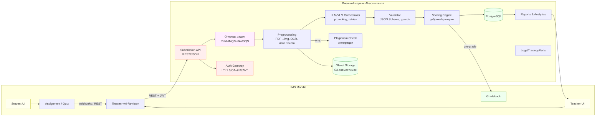
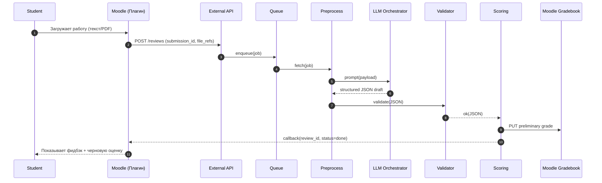
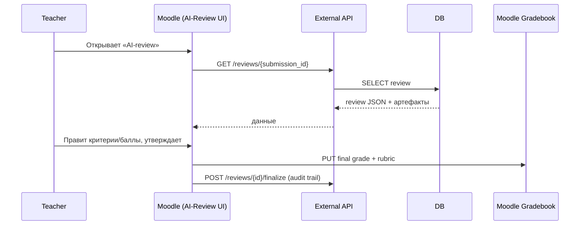

# Архитектура сервиса ИИ‑ассистента для Moodle

## 1) Цели и контекст

Сервис автоматически делает первичное ревью студенческих работ, формирует структурированный фидбэк и предварительную оценку в LMS Moodle, позволяет преподавателю быстро утвердить/скорректировать результат, а студенту — оперативно понять ошибки.

## 2) Функциональные требования

* Приём решений по HTTP (текст, файлы: PDF/изображения; позже — аудио/видео).
* Предобработка и парсинг входа, извлечение текста и/или визуального контента.
* Вызов LLM/VLM с жёстко типизированным контрактом ответа (JSON).
* Валидация ответа по схеме + вычисление итогового скора по критериям.
* Запись предварительной оценки в Moodle; доступ к фидбэку в UI.
* Редактирование/утверждение преподавателем; аудит изменений.
* Проверка на плагиат; аналитика по студентам/дисциплинам.
* Соблюдение приватности: отсутствует утечка ПДн третьих лиц; хранение минимум необходимого.

## 3) Высокоуровневая архитектура


```mermaid
@startuml
title AI‑Review Service — Component View
skinparam componentStyle rectangle
skinparam rectangle {
BorderColor #888
BackgroundColor #f9f9f9
}


package "LMS Moodle" <<Subsystem>> {
[Moodle Core]
[Plugin: AI‑Review] as Plugin
[Gradebook]
}


package "AI‑Review Service" <<Subsystem>> {
[API Gateway] as API
[Auth Gateway (LTI/OAuth2)] as AUTH
[Job Queue] as Q
[Preprocessing] as PRE
[LLM Orchestrator] as LLM
[Validator] as VAL
[Scoring Engine] as SCORE
[Report Builder] as REP
[Object Storage (S3/MinIO)] as S3
[Relational DB (PostgreSQL)] as DB
[Observability (Logs/Traces/Metrics)] as OBS
}


[Moodle Core] -down-> Plugin : events/webhooks
Plugin -right-> API : REST JSON (JWT/LTI)
API -down-> AUTH : token introspection
API -down-> Q : enqueue(job)
Q -down-> PRE : consume(job)
PRE -down-> LLM : prompt(payload)
LLM -up-> VAL : structured JSON
VAL -right-> SCORE : valid JSON
SCORE -down-> DB : store(review)
PRE -right-> S3 : store artifacts
REP -down-> S3 : read/export
SCORE -up-> Gradebook : preliminary grade (REST)
API -up-> Plugin : callback(status, links)
OBS .. API
OBS .. PRE
OBS .. LLM
OBS .. SCORE
@enduml
```



### Ключевые решения

* **Интеграция с Moodle**: плагин «AI‑Review» регистрирует хуки на события сдачи, предоставляет UI преподавателю и вызывает внешний сервис через REST.
* **Асинхронная обработка**: входные HTTP‑запросы ставятся в очередь, что исключает долгие таймауты. Moodle получает статус/прогресс и коллбек результата.
* **Строгая типизация ответа LLM**: ответ валидируется по JSON Schema; при несоответствии — авто‑ретрай или деградация к минимальному фидбэку.
* **Хранение**: бинарные файлы и превью — в S3, результаты/метаданные — в PostgreSQL.
* **Безопасность**: LTI 1.3/OAuth2 для доверия Moodle↔Service, частичная анонимизация входа, контроль токенов и шифрование.

## 4) Сквозные сценарии (sequence)

### 4.1. Первичное ревью на сдачу



### 4.2. Утверждение/коррекция преподавателем



## 5) Контракты данных

### 5.1. Вход в сервис

```json
POST /v1/reviews
{
  "submission_id": "string",
  "course_id": "string",
  "user_id": "string",
  "task_id": "string",
  "content": {                      
    "text": "...",               
    "files": [
      {"type":"pdf","url":"s3://..."},
      {"type":"image","url":"s3://..."}
    ]
  },
  "rubric": {                       
    "criteria": [
      {"id":"C1","title":"Форматирование","weight":0.1},
      {"id":"C2","title":"Корректность решения","weight":0.6},
      {"id":"C3","title":"Обоснование","weight":0.3}
    ],
    "scale": {"min":0, "max":100}
  },
  "callback_url": "https://moodle.local/ai/callback",
  "metadata": {"attempt":2}
}
```

### 5.2. Ответ LLM (стандартизированный)

```json
{
  "criteria": [
    {"id":"C1","score":70,"notes":"Шрифт, поля, нумерация"},
    {"id":"C2","score":85,"notes":"Верно, но нет оценки погрешностей"},
    {"id":"C3","score":60,"notes":"Не хватает пояснений к формуле (2)"}
  ],
  "structure": ["Аннотация","Введение","Методы","Результаты","Выводы"],
  "checks": [
    {"type":"formula_format","ok":false,"where":"p.3, eq.(2)","comment":"Вынесите индексы"}
  ],
  "regions": [
    {"page":3,"bbox":[120,220,340,260],"tag":"missing_reference"}
  ],
  "comment": "В целом решение верное; добавьте обоснование выбора метода и исправьте ссылку на таблицу 2."
}
```

### 5.3. Сводка и предварительная оценка

```json
{
  "review_id": "uuid",
  "submission_id": "string",
  "status": "done|failed|needs_teacher",
  "preliminary_score": 78,
  "rubric_breakdown": [...],
  "export": {
    "json_url": "s3://.../review.json",
    "html_url": "s3://.../review.html",
    "xlsx_url": "s3://.../review.xlsx"
  }
}
```

## 6) Интеграция с Moodle

**Вариант А (рекомендуется)**: плагин Moodle

* Хуки на события модулей (assign, quiz): on submission → вызвать внешний API.
* Страница преподавателя: список ревью, сравнение AI vs финальная оценка, кнопка «Утвердить».
* Безопасное хранилище S3 ссылок; подпись URL.
* Авторизация: OAuth2 или LTI 1.3, обмен JWT.

**Вариант Б**: без плагина, только Web Services

* Использование существующих REST API Moodle для получения/загрузки попыток.
* Подходит для пилота, но UI скромнее.

## 7) Подсистема предобработки

* **PDF → изображения** для визуального анализа; генерация превью/хайлайтов.
* **OCR** при сканах, fallback к извлечению текста из PDF.
* **Limiter** на количество страниц и DPI (конфигурация курса/задания).
* **Контент‑санитайзер**: удаление ФИО/номеров студента, метаданных.

## 8) Orchestrator и guardrails

* Шаблоны промптов: контекст задания + рубрика + формат JSON.
* Валидация JSON Schema; авто‑починка/перепрос в случае отклонений.
* Нормализация шкал баллов, вычисление итогового скора.
* Политики ретраев, дедлайны и лимиты токенов.

## 9) Плагиат и аналитика (этап 2)

* Интеграция с внешними сервисами антиплагиата или локальными индексами.
* Панель аналитики: сложные места по курсу, распределение баллов, динамика попыток.

## 10) Нефункциональные требования

* **Производительность**: SLA ответа «черновая оценка готова» ≤ N минут при очереди ≤ M.
* **Масштабирование**: горизонтальное (статeless API, воркеры по очереди).
* **Надёжность**: идемпотентность по `submission_id`, дедупликация задач.
* **Безопасность**: шифрование в покое/транзите, ротация ключей, аудиты.
* **Соблюдение ПДн**: минимизация данных, срок хранения настраиваемый.

## 11) Развёртывание

* **MVP**: Docker Compose (API, DB, MinIO, LLM‑gateway, Nginx).
* **Прод**: Kubernetes + Helm; ingress, HPA, секреты, наблюдаемость (OpenTelemetry).

## 12) API эскизы

* `POST /v1/reviews` — создать ревью.
* `GET /v1/reviews/{id}` — получить состояние/данные.
* `POST /v1/reviews/{id}/finalize` — зафиксировать итог преподавателя.
* `POST /v1/callbacks/moodle` — коллбек статуса в Moodle.
* `GET /v1/exports/{id}.{json|html|xlsx|pdf}` — артефакты.

## 13) Модель данных (упрощённо)

* `courses(id, name)`
* `tasks(id, course_id, rubric_json, settings_json)`
* `submissions(id, task_id, user_id, attempt, files[])`
* `reviews(id, submission_id, status, result_json, score, created_at)`
* `audit_logs(id, review_id, actor, action, diff_json, at)`

## 14) Контроль версий и тестирование

* Контрактные тесты для API (OpenAPI + Schemathesis).
* Набор эталонных работ и «золотых» ответов для регресса LLM.
* Юнит‑тесты моделей/скора; e2e — через плагин Moodle в test‑инстансе.

## 15) Дорожная карта релизов

* **v0.1 (MVP)**: текст/PDF, базовый LLM, rubric‑scoring, предварительная оценка, UI преподавателя.
* **v0.2**: OCR/превью/хайлайты, отчёты, анти‑плагиат.
* **v0.3**: поддержка аудио/видео, персонализация заданий, расширенная аналитика.

---

**Примечания по безопасности и этике**

* Не включать в ответы персональные данные других студентов.
* Логи и промпты — без ПДн и лишних артефактов; агрессивная фильтрация.
* Чёткий opt‑out от отправки данных во внешние модели (если требуется локальный inference).
